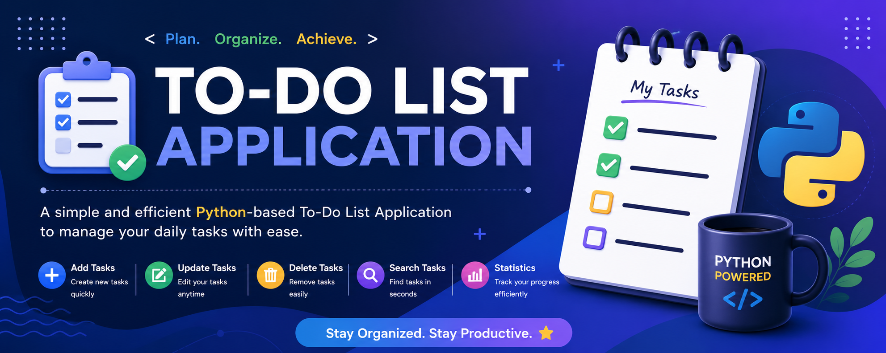

kia kro yaar acha sa bna do  yar<p align="center">
  
</p>

<h1 align="center">📝 To-Do List Application</h1>

<p align="center">
A Python-based To-Do List Application built using <b>Python</b>. It allows users to manage daily tasks with features like adding, updating, deleting, searching, sorting, and tracking task status.
</p>

<p align="center">


</p>

---

# 📌 Overview

This is a menu-driven To-Do List Application developed in Python. It helps users organize daily tasks efficiently through a simple console interface.

Users can create tasks, update them, delete them, search tasks, mark them as completed or pending, sort by priority, and view task statistics.

---

# ✨ Features

- ➕ Add New Task
- 📋 View All Tasks
- ✏️ Update Existing Task
- 🗑️ Delete Task
- 🔍 Search Task
- 📊 Count Total Tasks
- ✅ Mark Task as Completed
- ⏳ Mark Task as Pending
- 📁 View Completed Tasks
- 📂 View Pending Tasks
- 🔥 Sort Tasks by Priority
- 📈 Show Task Statistics
- 🧹 Clear All Tasks
- 🚪 Exit Application

---

# 🛠️ Technologies Used

- Python
- Lists
- Dictionaries
- Loops
- Conditional Statements
- Exception Handling

---

# 📂 Project Structure

```text
To-Do-List-Application/
│
├── todo_list.py
├── README.md
├── .gitignore
├── todo-banner.png
└── screenshots/
    ├── menu.png
    ├── add-task.png
    ├── view-task.png
    ├── completed-task.png
    └── statistics.png
```

---

# 🚀 How to Run

### 1️⃣ Clone the Repository

```bash
git clone https://github.com/Tehmina124/To-Do-List-Application.git
```

### 2️⃣ Open Project Folder

```bash
cd To-Do-List-Application
```

### 3️⃣ Run the Program

```bash
python todo_list.py
```

---

# 📸 Screenshots

## 🏠 Main Menu


---

## ➕ Add Task


---

## 📋 View Tasks


---

## ✅ Completed Task


---

## 📊 Statistics


---

# 🎯 Learning Outcomes

This project helped me improve my understanding of:

- Python Programming
- CRUD Operations
- Lists & Dictionaries
- Menu-Driven Applications
- Exception Handling
- Problem Solving
- Console-Based Projects

---

# 🔮 Future Improvements

- 💾 Save Tasks in a File
- 🖥️ GUI using Tkinter
- 🌐 Web Version using Streamlit
- 🗄️ Database Integration (SQLite/MySQL)
- 🔔 Task Reminder System
- 📅 Calendar Integration

---

# 🤝 Contributing

Contributions, suggestions, and feedback are always welcome.

If you like this project, don't forget to ⭐ the repository.

---

# 👩‍💻 Author

**Tehmina Anwar**

**AI/ML Engineer | Python Developer**

🌐 **Portfolio**  
https://tehmina-portfolio-five.vercel.app/

💼 **LinkedIn**  
https://www.linkedin.com/in/tehmina-anwar-77b8a8414/

💻 **GitHub**  
https://github.com/Tehmina124

📧 **Email**  
Tehminaanwar713@gmail.com

---

<p align="center">

⭐ Thank you for visiting my repository!

</p>
